# 高数基础30讲：知识点与思维导图

整理范围：根据 PDF《考研数学基础30讲·高等数学分册》目录整理。本分册正文共 18 讲，附录作为速查补充。  
使用建议：先按本文件建立完整框架，再把第二份“习题思路与重点筛选”中标为 A/B 的典型题搬回对应小节。

## 总体结构

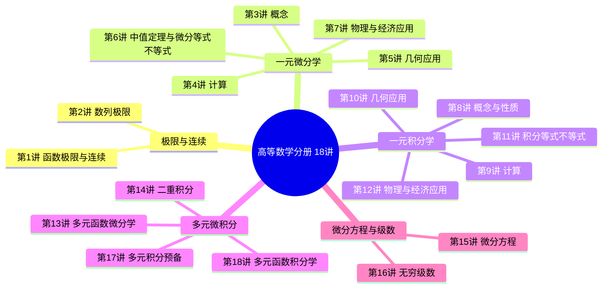
```mermaid
mindmap
  root((高等数学分册 18讲))
    极限与连续
      第1讲 函数极限与连续
      第2讲 数列极限
    一元微分学
      第3讲 概念
      第4讲 计算
      第5讲 几何应用
      第6讲 中值定理与微分等式不等式
      第7讲 物理与经济应用
    一元积分学
      第8讲 概念与性质
      第9讲 计算
      第10讲 几何应用
      第11讲 积分等式不等式
      第12讲 物理与经济应用
    多元微积分
      第13讲 多元函数微分学
      第14讲 二重积分
      第17讲 多元积分预备
      第18讲 多元函数积分学
    微分方程与级数
      第15讲 微分方程
      第16讲 无穷级数
```

---

## 第1讲 函数极限与连续

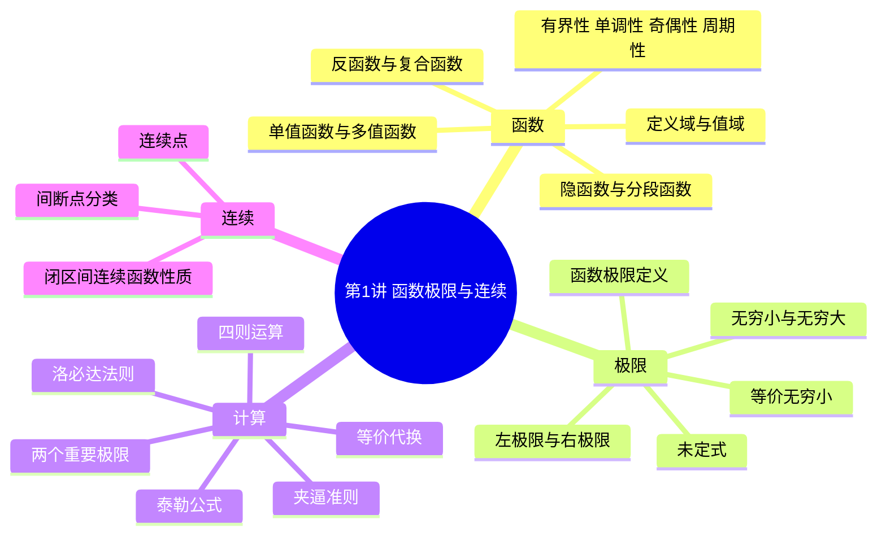
```mermaid
mindmap
  root((第1讲 函数极限与连续))
    函数
      定义域与值域
      单值函数与多值函数
      反函数与复合函数
      隐函数与分段函数
      有界性 单调性 奇偶性 周期性
    极限
      函数极限定义
      左极限与右极限
      无穷小与无穷大
      等价无穷小
      未定式
    计算
      四则运算
      夹逼准则
      两个重要极限
      等价代换
      洛必达法则
      泰勒公式
    连续
      连续点
      间断点分类
      闭区间连续函数性质
```

### 知识点清单

- 函数的基本要素：定义域、对应法则、值域。求定义域时同时考虑分母不为零、偶次根号非负、对数真数大于零、反三角函数定义域、实际问题约束。
- 单值函数：每个自变量至多对应一个函数值；图像上可用铅直画线法判断。多值关系不是通常意义下的函数。
- 反函数：一一对应时可谈反函数；严格单调是有反函数的充分条件。直接函数与反函数的图像在交换 $x,y$ 后关于 $y=x$ 对称。
- 复合函数：先内后外，定义域要同时满足内层函数有意义且内层值落入外层定义域。解复合函数问题常用“把内层整体看成新变量”。
- 隐函数：由方程 $F(x,y)=0$ 确定的函数，后续求导常用隐函数求导；本讲重点是识别关系和定义域。
- 函数四种特性：有界性、单调性、奇偶性、周期性。奇偶性必须先看定义域是否关于原点对称。
- 极限存在：函数极限存在等价于左右极限存在且相等。$x\to\infty$ 时注意 $+\infty$ 与 $-\infty$ 的单侧方向。
- 无穷小：极限为 0 的变量；无穷大：绝对值可超过任意正数的变量。无穷小与无穷大在同一极限过程中互为倒数关系，但要注意不恒为零。
- 无穷小阶：若 $\lim \alpha/\beta=0$，则 $\alpha$ 是比 $\beta$ 高阶的无穷小；若极限为非零常数，则同阶；若为 1，则等价。
- 常用等价无穷小（$x\to0$）：$\sin x\sim x$，$\tan x\sim x$，$\arcsin x\sim x$，$\arctan x\sim x$，$\ln(1+x)\sim x$，$e^x-1\sim x$，$a^x-1\sim x\ln a$，$1-\cos x\sim x^2/2$，$(1+x)^\alpha-1\sim \alpha x$。
- 等价代换原则：乘除结构中可直接替换；加减结构中谨慎，必须保证主部不被抵消。遇到相减后趋零，优先有理化、通分或泰勒展开。
- 两个重要极限：$\lim_{x\to0}\frac{\sin x}{x}=1$；$\lim_{x\to\infty}(1+\frac1x)^x=e$，以及等价形式 $\lim_{u\to0}(1+u)^{1/u}=e$。
- 极限四则：各部分极限存在且运算结果有意义时可用。遇到 $0/0,\infty/\infty,0\cdot\infty,\infty-\infty,1^\infty,0^0,\infty^0$ 要先变形。
- 洛必达法则：适用于 $0/0$ 或 $\infty/\infty$ 型，分子分母可导，分母导数不为零，并且导数比的极限存在或为无穷。使用前要确认型，不能机械求导。
- 泰勒公式：在高阶相消、含三角/指数/对数混合、等价无穷小不够用时使用。常用展开到首个非零项即可。
- 夹逼准则：被夹函数左右两边同趋于同一极限。常用于含 $\sin n,\cos n,(-1)^n$ 或绝对值估计的问题。
- 连续定义：$\lim_{x\to x_0}f(x)=f(x_0)$。连续必须同时满足函数值存在、极限存在、极限等于函数值。
- 间断点：第一类间断点左右极限都存在；可去间断是左右极限相等但不等于函数值或函数值不存在；跳跃间断是左右极限存在但不等。第二类间断点至少一侧极限不存在或为无穷。
- 闭区间连续函数性质：有界性、最值定理、介值定理、零点定理。证明方程有根常构造连续函数并找异号端点。
- 分段函数连续性：每段内部看初等函数，分界点看左右极限和函数值。参数题通常由连续条件列方程。

---

## 第2讲 数列极限

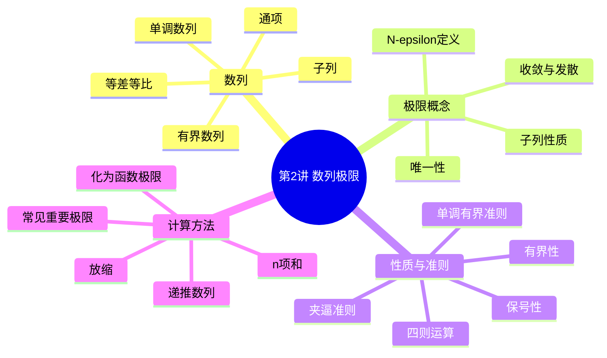
```mermaid
mindmap
  root((第2讲 数列极限))
    数列
      通项
      子列
      等差等比
      单调数列
      有界数列
    极限概念
      N-epsilon定义
      收敛与发散
      子列性质
      唯一性
    性质与准则
      有界性
      保号性
      四则运算
      夹逼准则
      单调有界准则
    计算方法
      化为函数极限
      放缩
      递推数列
      n项和
      常见重要极限
```

### 知识点清单

- 数列是定义在正整数集上的函数，记为 $\{a_n\}$。研究重点是 $n\to\infty$ 时的变化趋势。
- 子列：从原数列中按严格递增下标抽取的数列。若数列收敛，则任意子列收敛且极限相同；若存在两个子列极限不同，则原数列发散。
- 收敛定义：对任意 $\varepsilon>0$，存在 $N$，当 $n>N$ 时 $|a_n-A|<\varepsilon$。定义题常把绝对值不等式化为对 $n$ 的要求。
- 收敛数列性质：极限唯一；收敛必有界；极限保序与保号；四则运算成立；若 $a_n\to A$ 且 $f$ 在 $A$ 连续，则 $f(a_n)\to f(A)$。
- 有界不一定收敛，例如 $(-1)^n$；单调且有界必收敛，这是递推数列的重要入口。
- 夹逼准则：若 $b_n\le a_n\le c_n$ 且 $b_n,c_n$ 同趋于 $A$，则 $a_n\to A$。常用于估计含三角、根式、指数、阶乘、和式的数列。
- 常见极限：$\lim_{n\to\infty}\frac{1}{n^p}=0(p>0)$，$\lim q^n=0(|q|<1)$，$\lim\sqrt[n]{a}=1(a>0)$，$\lim\sqrt[n]{n}=1$，$\lim(1+\frac{x}{n})^n=e^x$。
- 多项式/有理式数列：分子分母同除最高次 $n$；根式差使用有理化；阶乘、指数、幂函数比较增长速度时通常指数快于幂函数，阶乘快于指数。
- 含 $\sum$ 的数列：先判断是固定项数还是随 $n$ 增加的项数。常用裂项相消、放缩、夹逼、黎曼和思想。
- 递推数列：先猜极限 $A$，由递推式令 $a_{n+1},a_n\to A$ 得方程；再证明收敛，常用单调有界或压缩估计。
- 单调性证明：比较 $a_{n+1}-a_n$ 或 $a_{n+1}/a_n$；含函数形式可研究对应函数单调性。
- 有界性证明：找显然上下界、归纳法、放缩、基本不等式、结合递推式不变区间。
- Stolz 思想（适用于部分 $\frac{a_n}{b_n}$ 型）：当 $b_n$ 严格单调趋无穷时，可研究差商 $\frac{a_{n+1}-a_n}{b_{n+1}-b_n}$。基础阶段先把它作为处理和式/阶乘比值的补充工具。
- 发散判断：极限不存在、趋于无穷、子列极限不同、必要条件不满足。不要把“有界震荡”误判为收敛。

---

## 第3讲 一元函数微分学的概念

```mermaid
mindmap
  root((第3讲 一元函数微分学的概念))
    导数
      增量式定义
      函数式定义
      左导数右导数
      导函数
    可导与连续
      可导必连续
      连续不一定可导
      尖点角点铅直切线
    微分
      可微定义
      dy=f'(x)dx
      线性主部
    几何意义
      切线斜率
      法线
      变化率
```

### 知识点清单

- 导数定义：$f'(x_0)=\lim_{\Delta x\to0}\frac{f(x_0+\Delta x)-f(x_0)}{\Delta x}$。也可写为 $\lim_{x\to x_0}\frac{f(x)-f(x_0)}{x-x_0}$。
- 增量式和函数式等价。题目会把 $\Delta x$ 变成 $h,2h,h^2,-h$ 等，关键是分母要与自变量增量一致。
- 左导数与右导数：$f'_-(x_0)$ 与 $f'_+(x_0)$ 均存在且相等，函数才在该点可导。
- 可导、导数存在、差商极限存在是同一件事。导数值必须是有限数；趋于无穷对应铅直切线，不算通常意义下可导。
- 可导必连续：若 $f'(x_0)$ 存在，则 $f(x)$ 在 $x_0$ 连续。反过来不成立，例如 $|x|$ 在 0 连续但不可导。
- 不可导常见原因：函数不连续；尖点或角点；震荡导致差商极限不存在；铅直切线导致差商趋无穷；分段函数左右导数不相等。
- 导函数：把每一点的导数作为新函数，记为 $f'(x)$。导函数存在区间不一定包含原函数定义域端点。
- 微分：若 $\Delta y=A\Delta x+o(\Delta x)$，则函数在 $x_0$ 可微，$dy=f'(x_0)dx$。一元函数中可微与可导等价。
- 微分的几何意义：用切线增量近似函数增量，即 $\Delta y\approx dy=f'(x_0)\Delta x$。
- 切线方程：$y-y_0=f'(x_0)(x-x_0)$。法线斜率为 $-1/f'(x_0)$，但水平切线和铅直法线要单独处理。
- 变化率意义：导数表示瞬时变化率，物理中可表示速度、边际变化等。
- 分段函数在分界点求导：先保证函数值和连续性，再分别求左右导数。
- 由定义求导适用于绝对值、分段、取整、狄利克雷型或题目要求证明可导性的情形。

---

## 第4讲 一元函数微分学的计算

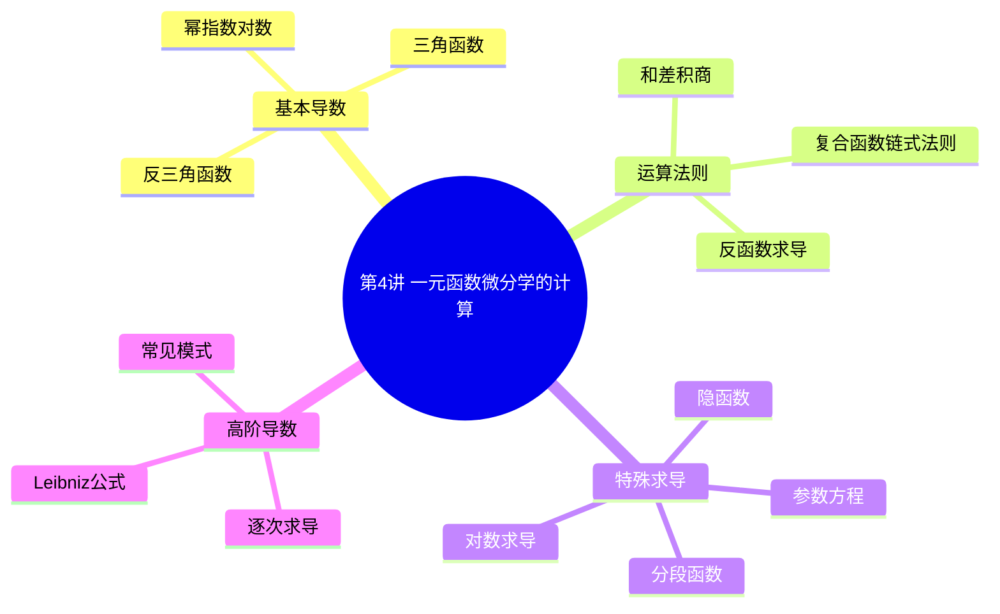
```mermaid
mindmap
  root((第4讲 一元函数微分学的计算))
    基本导数
      幂指数对数
      三角函数
      反三角函数
    运算法则
      和差积商
      复合函数链式法则
      反函数求导
    特殊求导
      隐函数
      参数方程
      对数求导
      分段函数
    高阶导数
      逐次求导
      Leibniz公式
      常见模式
```

### 知识点清单

- 基本公式：$(x^\alpha)'=\alpha x^{\alpha-1}$，$(e^x)'=e^x$，$(a^x)'=a^x\ln a$，$(\ln x)'=1/x$，$(\log_a x)'=1/(x\ln a)$。
- 三角函数导数：$(\sin x)'=\cos x$，$(\cos x)'=-\sin x$，$(\tan x)'=\sec^2x$，$(\cot x)'=-\csc^2x$。
- 反三角函数导数：$(\arcsin x)'=1/\sqrt{1-x^2}$，$(\arccos x)'=-1/\sqrt{1-x^2}$，$(\arctan x)'=1/(1+x^2)$。
- 四则法则：$(uv)'=u'v+uv'$，$(u/v)'=(u'v-uv')/v^2$。复杂乘除式可先取对数。
- 链式法则：$(f(g(x)))'=f'(g(x))g'(x)$。多层复合从外到内逐层乘。
- 反函数求导：若 $y=f(x)$ 单调可导且 $f'(x)\ne0$，则 $(f^{-1})'(y)=1/f'(x)$。注意变量对应。
- 隐函数求导：对方程 $F(x,y)=0$ 两边对 $x$ 求导，把 $y$ 看作 $y(x)$，即 $y'$ 随链式法则出现。一般 $y'=-F_x/F_y$。
- 参数方程求导：若 $x=x(t),y=y(t)$，则 $\frac{dy}{dx}=\frac{dy/dt}{dx/dt}$；二阶导数为 $\frac{d}{dt}(dy/dx)/(dx/dt)$。
- 对数求导：适合幂指函数、多个因子乘除、变量在底数和指数同时出现的表达式。先取 $\ln$，再两边求导。
- 高阶导数：常见函数反复求导有周期或模式，如 $\sin,\cos,e^{ax},\ln(1+x),(1+x)^\alpha$。可先写一般项再验证。
- Leibniz 公式：$(uv)^{(n)}=\sum_{k=0}^n C_n^k u^{(k)}v^{(n-k)}$，适用于一个因子高阶后很快为零的乘积。
- 分段函数求导：区间内部按公式，分界点用导数定义或左右导数，不能只代公式。
- 绝对值函数求导：先按正负拆分，或使用 $|u|'=u'\operatorname{sgn}u$（仅 $u\ne0$）。
- 求导前的化简：指数对数化、三角恒等变形、有理化、拆项，常能降低计算量。

---

## 第5讲 一元函数微分学的应用（一）：几何应用

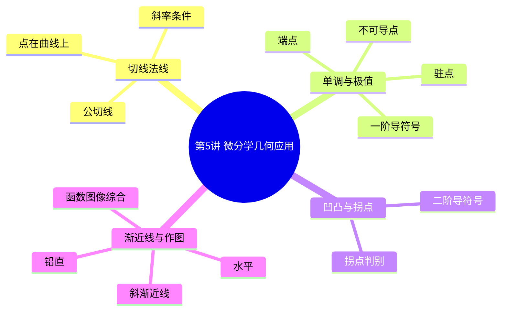
```mermaid
mindmap
  root((第5讲 微分学几何应用))
    切线法线
      点在曲线上
      斜率条件
      公切线
    单调与极值
      一阶导符号
      驻点
      不可导点
      端点
    凹凸与拐点
      二阶导符号
      拐点判别
    渐近线与作图
      水平
      铅直
      斜渐近线
      函数图像综合
```

### 知识点清单

- 切线方程：若切点为 $(x_0,f(x_0))$ 且 $f'(x_0)$ 存在，则 $y-f(x_0)=f'(x_0)(x-x_0)$。
- 法线方程：$y-f(x_0)=-\frac1{f'(x_0)}(x-x_0)$。若 $f'(x_0)=0$，法线为 $x=x_0$；若铅直切线，切线为 $x=x_0$。
- “过某点作切线”要区分给定点是否为切点。未知切点时设切点 $t$，列斜率等式和过点条件。
- 单调性：在区间内 $f'(x)\ge0$ 通常推出单调不减，$f'(x)>0$ 推出严格递增的常用充分条件。实际判定看导数符号表。
- 极值必要条件：内点可导且取极值，则 $f'(x_0)=0$。但驻点不一定是极值点，不可导点也可能是极值点。
- 极值判别：一阶导变号，正到负为极大，负到正为极小；二阶导 $f''(x_0)>0$ 极小，$f''(x_0)<0$ 极大。
- 最值：闭区间连续函数最值在端点、驻点、不可导点中比较函数值。
- 凹凸性：常以 $f''(x)$ 符号判定。$f''>0$ 图像凹向上，$f''<0$ 图像凹向下（按教材定义注意名称）。
- 拐点：函数连续且凹凸性发生改变的点。$f''(x_0)=0$ 不是充分条件，要看左右符号。
- 水平渐近线：$\lim_{x\to\pm\infty}f(x)=b$。铅直渐近线：$\lim_{x\to a^\pm}f(x)=\infty$。斜渐近线：$y=kx+b$，其中 $k=\lim f(x)/x$，$b=\lim(f(x)-kx)$。
- 函数作图流程：定义域、奇偶周期、截距、间断与渐近线、一阶导单调极值、二阶导凹凸拐点、端点趋势。
- 几何不等式题常转化为函数单调、极值或凸性；图像直观必须用导数判定兜底。

---

## 第6讲 一元函数微分学的应用（二）：中值定理、微分等式与微分不等式

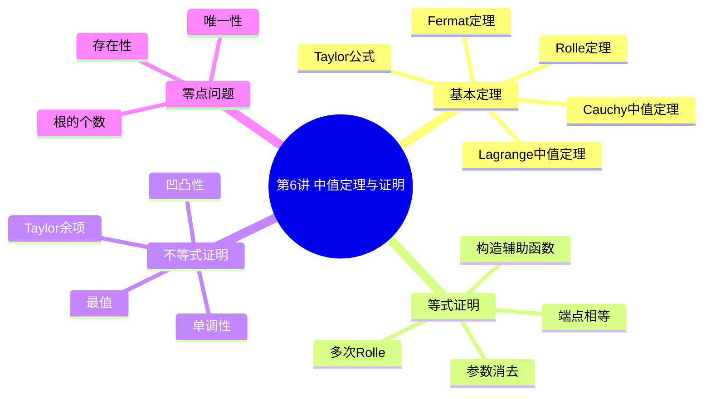
```mermaid
mindmap
  root((第6讲 中值定理与证明))
    基本定理
      Fermat定理
      Rolle定理
      Lagrange中值定理
      Cauchy中值定理
      Taylor公式
    等式证明
      构造辅助函数
      端点相等
      多次Rolle
      参数消去
    不等式证明
      单调性
      最值
      Taylor余项
      凹凸性
    零点问题
      存在性
      唯一性
      根的个数
```

### 知识点清单

- Fermat 定理：可导函数在内点取得极值，则导数为零。常是 Rolle 定理的基础。
- Rolle 定理：$f$ 在 $[a,b]$ 连续、$(a,b)$ 可导，且 $f(a)=f(b)$，则存在 $\xi$ 使 $f'(\xi)=0$。
- Lagrange 中值定理：存在 $\xi$ 使 $f'(\xi)=\frac{f(b)-f(a)}{b-a}$。它连接函数增量与导数。
- Cauchy 中值定理：存在 $\xi$ 使 $\frac{f'(\xi)}{g'(\xi)}=\frac{f(b)-f(a)}{g(b)-g(a)}$，常用于比值型、洛必达证明、含两个函数的等式。
- Taylor 公式：$f(x)=f(x_0)+f'(x_0)(x-x_0)+\cdots+\frac{f^{(n)}(x_0)}{n!}(x-x_0)^n+R_n$。证明不等式常保留到合适阶数并判断余项符号。
- 中值定理题核心是构造：把待证结论改写成某个函数在某点导数为零或某两个点斜率相等。
- 构造辅助函数常见入口：含 $f'(\xi)$ 想 Rolle/Lagrange；含 $f'(\xi)/g'(\xi)$ 想 Cauchy；含多阶导想多次 Rolle 或 Taylor。
- 多零点问题：函数有 $n$ 个零点，则导函数至少有 $n-1$ 个零点；反复使用可得到高阶导零点。
- 方程根存在：连续函数用零点定理；含导数条件可用 Rolle 反推。根唯一常用单调性。
- 微分等式证明：先移项成 $F(\xi)=0$、$F'(\xi)=0$ 或 $F'(x)$ 的中值形式，再选定端点。
- 微分不等式证明：常用函数单调性、最大最小值、Lagrange 中值定理估计、Taylor 展开与凸性。
- 凸性工具：若 $f''\ge0$，则 $f'$ 单调，图像在切线上方、割线下方（按具体结论写）。Jensen 型题可用凸性语言，但基础阶段以导数证明为主。
- 参数型证明：把参数看成变量构造函数，证明函数恒定、单调或有零点。
- 易错点：Rolle 条件中连续区间和可导开区间不能缺；端点相等通常需要通过构造得到，而不是原函数天然满足。

---

## 第7讲 一元函数微分学的应用（三）：物理应用与经济应用

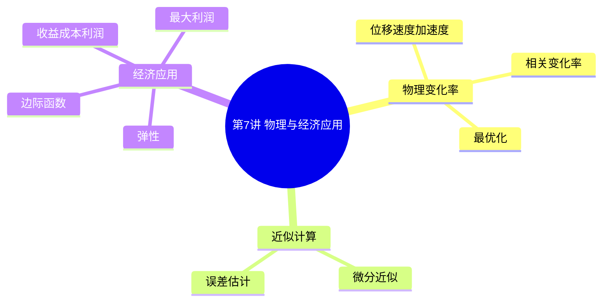
```mermaid
mindmap
  root((第7讲 物理与经济应用))
    物理变化率
      位移速度加速度
      相关变化率
      最优化
    近似计算
      微分近似
      误差估计
    经济应用
      边际函数
      弹性
      收益成本利润
      最大利润
```

### 知识点清单

- 速度与加速度：若位置 $s=s(t)$，则速度 $v=s'(t)$，加速度 $a=v'(t)=s''(t)$。位移和路程要区分方向。
- 相关变化率：多个变量由几何关系联系，对时间求导，代入已知瞬时值求目标变化率。
- 最优化建模：设变量、写目标函数、确定定义域、求导找驻点和边界值、回到实际单位解释。
- 微分近似：$\Delta y\approx dy=f'(x_0)\Delta x$。用于近似值和误差估计。
- 绝对误差与相对误差：绝对误差近似 $|dy|$，相对误差近似 $|dy/y|$。
- 边际概念：总成本 $C(x)$、收益 $R(x)$、利润 $L(x)=R(x)-C(x)$；边际成本 $C'(x)$、边际收益 $R'(x)$、边际利润 $L'(x)$。
- 弹性：常见形式 $E=\frac{x}{y}y'$，表示自变量相对变化引起因变量相对变化的倍数。
- 最大利润：通常令 $L'(x)=0$，或边际收益等于边际成本 $R'(x)=C'(x)$，再结合二阶导或单调性判定。
- 应用题关键是单位和定义域，数学极值点若不在实际定义域内无意义。

---

## 第8讲 一元函数积分学的概念与性质

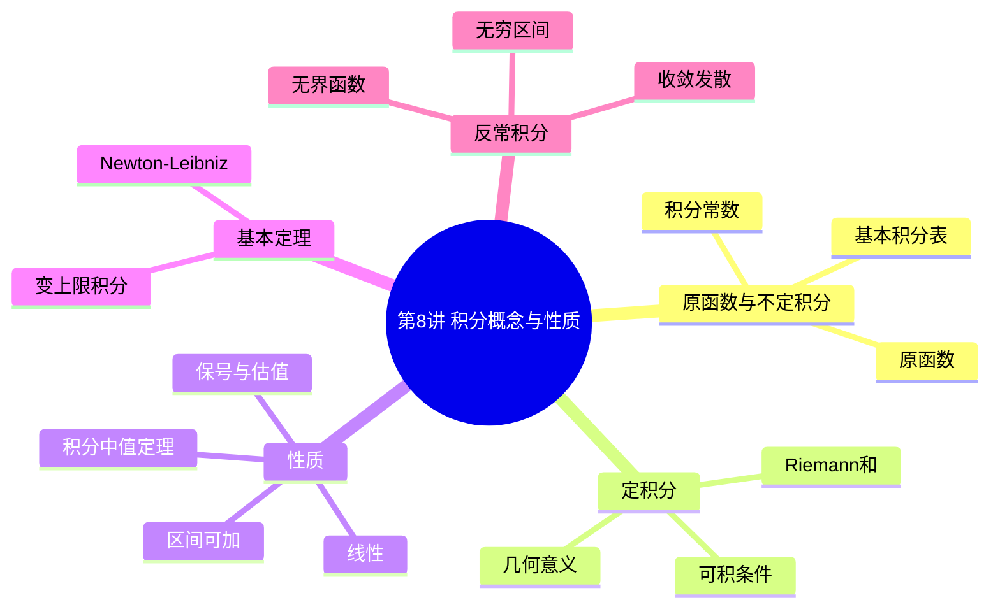
```mermaid
mindmap
  root((第8讲 积分概念与性质))
    原函数与不定积分
      原函数
      积分常数
      基本积分表
    定积分
      Riemann和
      几何意义
      可积条件
    性质
      线性
      区间可加
      保号与估值
      积分中值定理
    基本定理
      变上限积分
      Newton-Leibniz
    反常积分
      无穷区间
      无界函数
      收敛发散
```

### 知识点清单

- 原函数：若 $F'(x)=f(x)$，则 $F$ 是 $f$ 的原函数。不定积分 $\int f(x)\,dx=F(x)+C$。
- 定积分：通过分割、近似、求和、取极限定义，表示带符号面积、累积量或平均意义。
- 可积性：连续函数可积；有界且只有有限个间断点的函数通常可积；有限个跳跃不影响定积分存在。
- 定积分线性：$\int_a^b(\alpha f+\beta g)=\alpha\int_a^b f+\beta\int_a^b g$。
- 区间可加：$\int_a^b f=\int_a^c f+\int_c^b f$；反向积分 $\int_a^b f=-\int_b^a f$。
- 保号性与比较：若 $f\ge0$，则 $\int_a^b f\ge0$；若 $f\le g$，则 $\int_a^b f\le\int_a^b g$。
- 估值：若 $m\le f(x)\le M$，则 $m(b-a)\le\int_a^b f\le M(b-a)$。
- 积分中值定理：连续函数在 $[a,b]$ 上存在 $\xi$ 使 $\int_a^b f(x)dx=f(\xi)(b-a)$。带权形式要求权函数不变号。
- 变上限积分：$F(x)=\int_a^x f(t)dt$，若 $f$ 连续，则 $F'(x)=f(x)$。若上限为 $\phi(x)$，则 $\frac{d}{dx}\int_a^{\phi(x)}f(t)dt=f(\phi(x))\phi'(x)$。
- Newton-Leibniz 公式：若 $F'=f$，则 $\int_a^b f(x)dx=F(b)-F(a)$。
- 对称性：奇函数在对称区间积分为 0，偶函数在对称区间积分为两倍半区间积分。
- 周期性：周期函数在整数个周期上的积分可化为一个周期积分；平移区间长度为周期时积分不变。
- 反常积分：无穷区间或被积函数无界时先改写为极限。收敛必须极限存在且有限。
- 常见反常积分判别：$\int_1^\infty \frac{dx}{x^p}$ 在 $p>1$ 收敛；$\int_0^1 \frac{dx}{x^p}$ 在 $p<1$ 收敛。

---

## 第9讲 一元函数积分学的计算

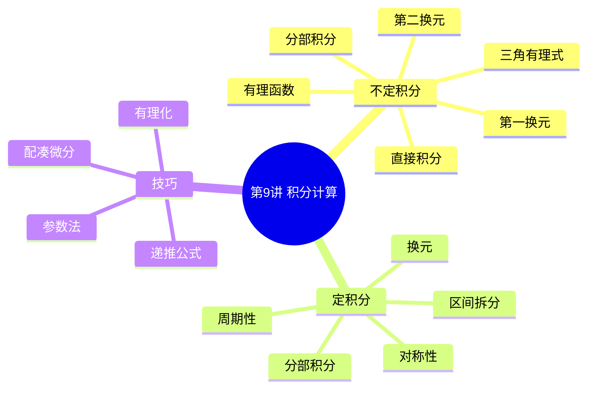
```mermaid
mindmap
  root((第9讲 积分计算))
    不定积分
      直接积分
      第一换元
      第二换元
      分部积分
      有理函数
      三角有理式
    定积分
      换元
      分部积分
      对称性
      周期性
      区间拆分
    技巧
      配凑微分
      有理化
      递推公式
      参数法
```

### 知识点清单

- 直接积分：先识别基本积分表，包括幂函数、指数、对数、三角、反三角形式。
- 第一类换元（凑微分）：形如 $f(\phi(x))\phi'(x)$，令 $u=\phi(x)$。关键是外层函数和内层导数同时出现。
- 第二类换元：用于根式、三角根式、有理化。常见如 $x=a\sin t$，$x=a\tan t$，$x=a\sec t$，或根式整体代换。
- 分部积分：$\int u\,dv=uv-\int v\,du$。选择 $u$ 的原则是求导后更简单，如对数、反三角、多项式。
- 多次分部：指数与三角乘积常出现循环；多项式乘指数/三角会因多项式次数降低而终止。
- 有理函数积分：先做多项式除法，再部分分式分解；一次因式对应对数，二次不可约因式对应对数和反正切。
- 三角函数积分：奇次正弦/余弦留一个凑微分；偶次用降幂公式；$\tan,\sec$ 组合看是否能凑 $\sec^2x$ 或 $\sec x\tan x$。
- 定积分换元：上下限必须随变量一起变。若换元后再换回原变量，才使用原上下限。
- 定积分分部：$\int_a^b u\,dv=[uv]_a^b-\int_a^b v\,du$，端点项经常简化。
- 对称区间计算：先判断奇偶；若含 $f(x)+f(a+b-x)$，考虑关于区间中点换元。
- 公式 $\int_0^a f(x)dx=\int_0^a f(a-x)dx$，$\int_a^b f(x)dx=\int_a^b f(a+b-x)dx$ 常用于配对。
- 含绝对值、分段、最大最小值的积分：先找分界点再拆区间。
- 递推积分：通过分部积分建立 $I_n$ 与 $I_{n-1}$ 或 $I_{n-2}$ 的关系，注意初值。
- 参数积分：先对参数求导、积分或利用恒等变形，最后用初值确定常数。
- 积分计算检查：求不定积分后求导验证；定积分结果注意符号、区间方向和单位。

---

## 第10讲 一元函数积分学的应用（一）：几何应用

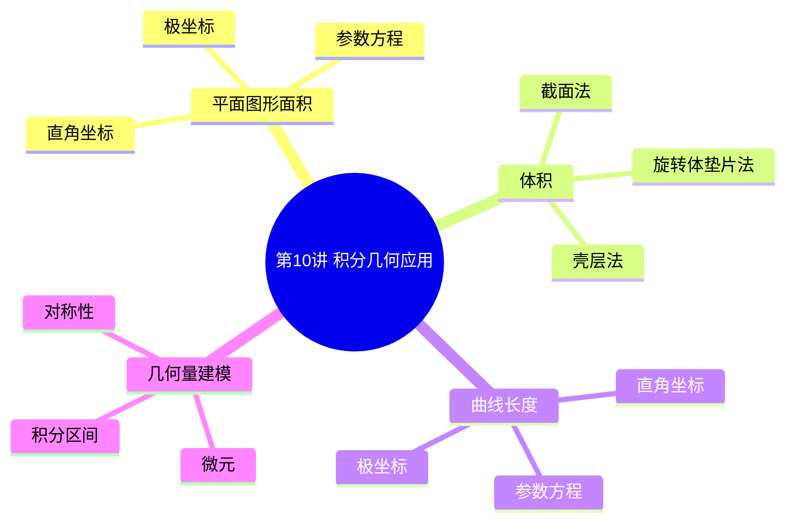
```mermaid
mindmap
  root((第10讲 积分几何应用))
    平面图形面积
      直角坐标
      参数方程
      极坐标
    体积
      截面法
      旋转体垫片法
      壳层法
    曲线长度
      直角坐标
      参数方程
      极坐标
    几何量建模
      微元
      积分区间
      对称性
```

### 知识点清单

- 面积微元：直角坐标下 $A=\int_a^b [y_{\text{上}}(x)-y_{\text{下}}(x)]dx$，或对 $y$ 积分。
- 面积题先画区域、找交点、确定上下或左右函数。若上下关系变化，必须拆区间。
- 参数方程面积：若曲线由 $x=x(t),y=y(t)$ 给出，可把 $dx=x'(t)dt$ 代入面积公式，注意参数方向和取绝对值。
- 极坐标面积：$A=\frac12\int_\alpha^\beta r^2(\theta)d\theta$。两曲线之间面积为 $\frac12\int(r_1^2-r_2^2)d\theta$。
- 体积截面法：$V=\int_a^b A(x)dx$，其中 $A(x)$ 为垂直于 $x$ 轴的截面积。
- 旋转体垫片法：绕 $x$ 轴旋转，$V=\pi\int_a^b(R^2-r^2)dx$；绕 $y$ 轴时通常对 $y$ 积分。
- 壳层法：$V=2\pi\int(\text{半径})(\text{高})\,dx$ 或 $dy$，适用于绕轴方向与积分微元平行时。
- 曲线弧长：直角坐标 $s=\int_a^b\sqrt{1+[y'(x)]^2}dx$；参数方程 $s=\int_\alpha^\beta\sqrt{(x')^2+(y')^2}dt$；极坐标 $s=\int\sqrt{r^2+(r')^2}d\theta$。
- 旋转曲面面积（若要求）：$S=2\pi\int(\text{旋转半径})\,ds$。
- 几何应用统一流程：画图、选微元、写局部量、确定积分限、利用对称性、计算并检查单位。

---

## 第11讲 一元函数积分学的应用（二）：积分等式与积分不等式

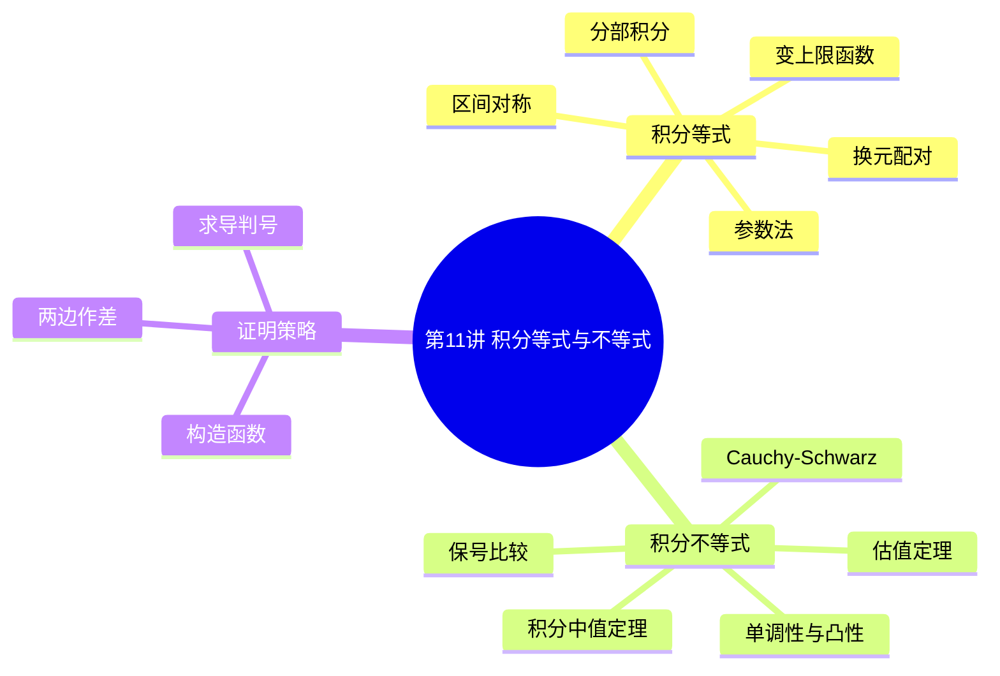
```mermaid
mindmap
  root((第11讲 积分等式与不等式))
    积分等式
      换元配对
      区间对称
      分部积分
      变上限函数
      参数法
    积分不等式
      保号比较
      估值定理
      积分中值定理
      Cauchy-Schwarz
      单调性与凸性
    证明策略
      构造函数
      两边作差
      求导判号
```

### 知识点清单

- 积分等式常见做法：换元 $x\mapsto a+b-x$、利用奇偶周期、分部积分、构造变上限函数后证明导数为零。
- 对称配对：$\int_a^b f(x)dx=\int_a^b f(a+b-x)dx$。两式相加可制造 $f(x)+f(a+b-x)$。
- 变上限函数法：设 $F(x)=\int_{\alpha(x)}^{\beta(x)} f(x,t)dt$ 或题目中的一边，求 $F'(x)$ 证明恒等或单调。
- 参数法：把难算的常数或指数看成参数，对参数求导后积分，再用初值定常数。
- 积分不等式的直接比较：若能证明被积函数点态不等式，就积分。注意区间方向和权函数符号。
- 估值定理：利用函数上下界 $m,M$ 得到积分上下界。最值可由导数或基本不等式确定。
- 积分中值定理：连续函数与不变号权函数可抽出某个函数值，适合证明存在 $\xi$。
- Cauchy-Schwarz：$(\int_a^b fg)^2\le(\int_a^b f^2)(\int_a^b g^2)$，常见于平方积分和乘积积分。
- 单调性不等式：若 $f,g$ 同单调，可用排序思想；基础题通常化为两边作差再写成非负积分。
- 凸性不等式：用切线、割线或 Jensen 型结论，但最好转回导数判定。
- 两边作差：把目标写为 $I_1-I_2$，通过合并积分、换元或分部积分化为显然非负/非正。
- 易错点：积分中值定理中的 $\xi$ 依赖区间和函数，不能当成固定常数随意代换。

---

## 第12讲 一元函数积分学的应用（三）：物理应用与经济应用

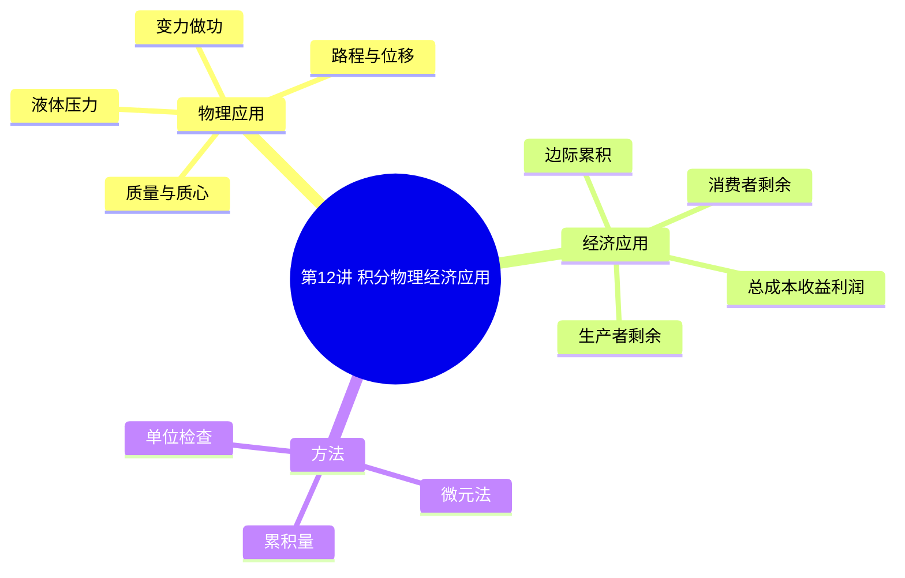
```mermaid
mindmap
  root((第12讲 积分物理经济应用))
    物理应用
      变力做功
      液体压力
      质量与质心
      路程与位移
    经济应用
      边际累积
      总成本收益利润
      消费者剩余
      生产者剩余
    方法
      微元法
      累积量
      单位检查
```

### 知识点清单

- 积分应用本质：把连续累积量拆成微元，写成 $dQ$，再在对应区间积分。
- 变力做功：$W=\int_a^b F(x)dx$。若力和位移方向有关，要取沿运动方向的分量。
- 由速度求路程：位移为 $\int v(t)dt$，路程为 $\int |v(t)|dt$。
- 质量：线密度、面密度、体密度对应 $dm=\rho ds,\rho dA,\rho dV$。一元场景多为线密度积分。
- 质心：$\bar{x}=\frac{1}{M}\int x\,dm$。薄板或曲线问题要先写质量微元。
- 液体压力：压力微元 $dF=\rho g h\,dA$，关键是深度 $h$ 与面积微元 $dA$。
- 经济中的边际累积：若边际成本 $C'(x)$ 已知，则成本增量为 $\int C'(x)dx$；收益和利润同理。
- 消费者剩余和生产者剩余：以需求/供给函数和市场价格围成的面积表示，核心是画图和确定积分上下限。
- 应用题最后必须检查量纲、正负号和实际范围。

---

## 第13讲 多元函数微分学

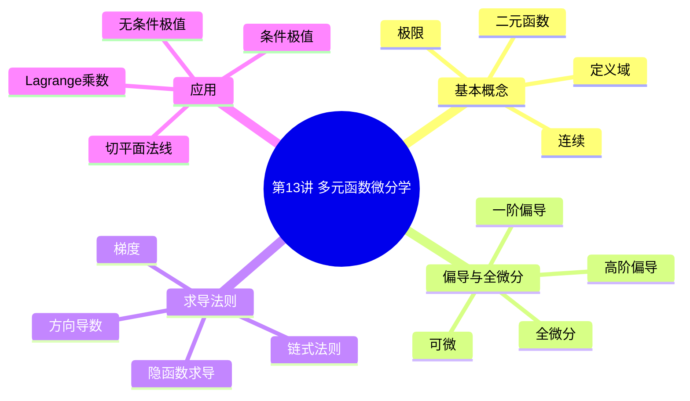
```mermaid
mindmap
  root((第13讲 多元函数微分学))
    基本概念
      二元函数
      定义域
      极限
      连续
    偏导与全微分
      一阶偏导
      高阶偏导
      可微
      全微分
    求导法则
      链式法则
      隐函数求导
      方向导数
      梯度
    应用
      切平面法线
      无条件极值
      条件极值
      Lagrange乘数
```

### 知识点清单

- 二元函数定义域：由根号、分母、对数、反三角函数及实际条件共同决定，常画成平面区域。
- 二元极限：$(x,y)\to(x_0,y_0)$ 时与路径无关才存在。证明不存在常取不同路径，如直线、抛物线、极坐标路径。
- 二元连续：极限存在且等于函数值。初等函数在定义域内通常连续。
- 偏导数：固定其他变量，对一个变量求导。偏导存在只说明沿坐标方向的变化率存在。
- 可微：$\Delta z=f_x\Delta x+f_y\Delta y+o(\rho)$，其中 $\rho=\sqrt{(\Delta x)^2+(\Delta y)^2}$。可微推出连续和偏导存在，偏导存在不一定可微。
- 可微充分条件：偏导数在点邻域存在并在该点连续，则函数可微。
- 全微分：$dz=f_xdx+f_ydy$，多元近似计算用 $\Delta z\approx dz$。
- 高阶偏导：在连续条件下混合偏导相等，即 $f_{xy}=f_{yx}$。
- 复合函数链式法则：若 $z=f(u,v),u=u(x,y),v=v(x,y)$，则 $z_x=f_u u_x+f_v v_x$，$z_y=f_u u_y+f_v v_y$。
- 隐函数求导：若 $F(x,y)=0$，则 $y'=-F_x/F_y$；若 $F(x,y,z)=0$，则 $z_x=-F_x/F_z$，$z_y=-F_y/F_z$。
- 方向导数：$\frac{\partial f}{\partial l}=f_x\cos\alpha+f_y\cos\beta=\nabla f\cdot \mathbf{e}$。
- 梯度：$\nabla f=(f_x,f_y)$，方向为函数增长最快方向，模为最大方向导数。
- 曲面切平面：$z=f(x,y)$ 在点处切平面 $z-z_0=f_x(x_0,y_0)(x-x_0)+f_y(x_0,y_0)(y-y_0)$。
- 一般曲面 $F(x,y,z)=0$ 的法向量为 $\nabla F$，切平面为 $F_x(x-x_0)+F_y(y-y_0)+F_z(z-z_0)=0$。
- 无条件极值：解 $f_x=f_y=0$ 得驻点，再用 $A=f_{xx},B=f_{xy},C=f_{yy}$ 判别。$AC-B^2>0$ 且 $A>0$ 极小，$A<0$ 极大；$AC-B^2<0$ 非极值。
- 条件极值：约束 $\varphi(x,y)=0$ 下用 Lagrange：$\nabla f=\lambda\nabla\varphi$，再联立约束。
- 多元最值：闭有界区域连续函数一定有最值，需比较内部驻点、边界和角点。

---

## 第14讲 二重积分

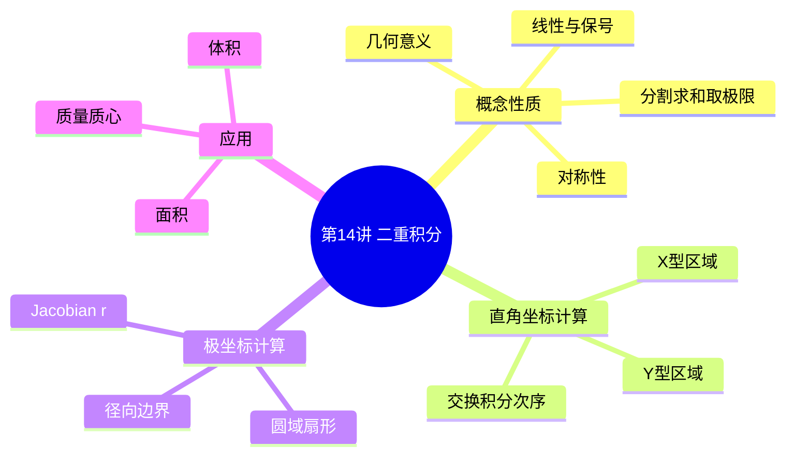
```mermaid
mindmap
  root((第14讲 二重积分))
    概念性质
      分割求和取极限
      几何意义
      线性与保号
      对称性
    直角坐标计算
      X型区域
      Y型区域
      交换积分次序
    极坐标计算
      圆域扇形
      径向边界
      Jacobian r
    应用
      体积
      面积
      质量质心
```

### 知识点清单

- 二重积分定义：在平面闭区域上分割、取点、求和并取极限，记为 $\iint_D f(x,y)d\sigma$。
- 几何意义：当 $f\ge0$ 时表示以 $D$ 为底、$z=f(x,y)$ 为顶的曲顶柱体体积。
- 性质：线性、区域可加、保号、比较、估值、中值定理。若 $f$ 连续，则二重积分存在。
- 直角坐标 X 型区域：$D=\{(x,y):a\le x\le b,\varphi_1(x)\le y\le\varphi_2(x)\}$，积分为 $\int_a^b dx\int_{\varphi_1}^{\varphi_2}fdy$。
- Y 型区域：$D=\{(x,y):c\le y\le d,\psi_1(y)\le x\le\psi_2(y)\}$。
- 交换积分次序：先画区域，再改写成另一类型区域。复杂区域需拆分。
- 极坐标：$x=r\cos\theta,y=r\sin\theta,d\sigma=rdrd\theta$。适合圆、扇形、环形、含 $x^2+y^2$ 的被积函数。
- 对称性：区域关于轴或原点对称时，奇函数部分积分为 0；偶对称可倍乘。要同时看区域和被积函数。
- 一般变量替换：$d\sigma=|J|dudv$，其中 $J=\frac{\partial(x,y)}{\partial(u,v)}$。
- 面积：$\iint_D1\,d\sigma$。体积：$\iint_D f(x,y)d\sigma$ 或上下曲面差。
- 质量与质心：$M=\iint_D\rho d\sigma$，$\bar{x}=\frac1M\iint_D x\rho d\sigma$，$\bar{y}=\frac1M\iint_D y\rho d\sigma$。
- 计算顺序选择：优先让区域简单、被积函数容易积分、对称性明显。

---

## 第15讲 微分方程

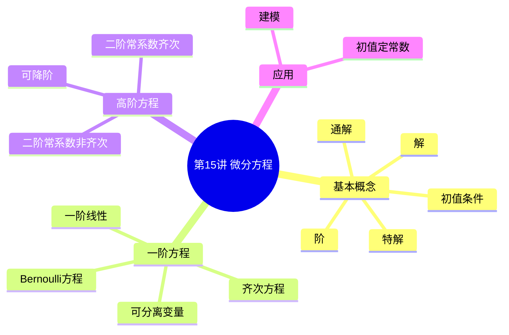
```mermaid
mindmap
  root((第15讲 微分方程))
    基本概念
      阶
      解
      通解
      特解
      初值条件
    一阶方程
      可分离变量
      齐次方程
      一阶线性
      Bernoulli方程
    高阶方程
      可降阶
      二阶常系数齐次
      二阶常系数非齐次
    应用
      建模
      初值定常数
```

### 知识点清单

- 微分方程：含未知函数及其导数的方程。阶数是方程中最高阶导数的阶。
- 通解：含任意常数且常数个数等于方程阶数的解族。特解：满足初值或边界条件的具体解。
- 可分离变量：$y'=X(x)Y(y)$，化为 $\frac{dy}{Y(y)}=X(x)dx$ 后积分。
- 齐次一阶方程：$y'=F(y/x)$，令 $v=y/x$ 或 $y=vx$。
- 一阶线性方程：$y'+P(x)y=Q(x)$，积分因子 $\mu=e^{\int Pdx}$，解为 $y\mu=\int Q\mu dx+C$。
- Bernoulli 方程：$y'+P(x)y=Q(x)y^n$，令 $z=y^{1-n}$ 化为一阶线性。
- 可降阶二阶方程：不显含 $y$ 时令 $p=y'$；不显含 $x$ 时令 $p(y)=y'$，用 $y''=p\,dp/dy$。
- 二阶常系数齐次：$y''+py'+qy=0$，特征方程 $r^2+pr+q=0$。不同实根、重根、共轭复根对应不同通解。
- 二阶常系数非齐次：通解为齐次通解加一个特解。右端为指数、多项式、三角函数组合时用待定系数法；注意与齐次解重复时乘 $x^s$。
- 线性方程叠加原理：非齐次右端可拆分，分别求特解再相加。
- 初值问题：先求通解，再代初值确定常数。代入前不要丢失由分离变量造成的特殊解。
- 应用建模：确定状态变量，写变化率关系，列微分方程，解方程，代初值，解释结果。

---

## 第16讲 无穷级数（仅数学一、数学三）

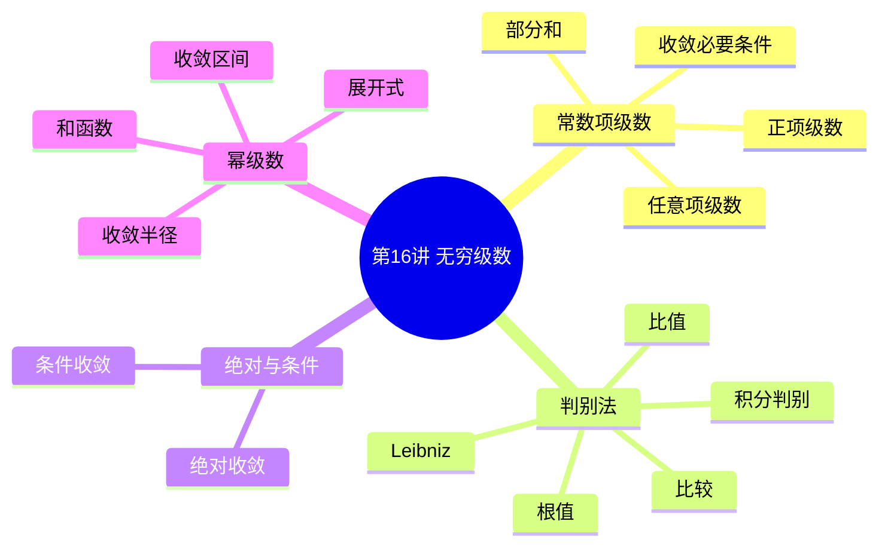
```mermaid
mindmap
  root((第16讲 无穷级数))
    常数项级数
      部分和
      收敛必要条件
      正项级数
      任意项级数
    判别法
      比较
      比值
      根值
      积分判别
      Leibniz
    绝对与条件
      绝对收敛
      条件收敛
    幂级数
      收敛半径
      收敛区间
      和函数
      展开式
```

### 知识点清单

- 级数 $\sum u_n$ 的收敛性由部分和 $S_n=\sum_{k=1}^n u_k$ 的极限决定。
- 收敛必要条件：若 $\sum u_n$ 收敛，则 $u_n\to0$。反之不成立。
- 几何级数：$\sum aq^{n-1}$ 在 $|q|<1$ 收敛，和为 $a/(1-q)$；$|q|\ge1$ 发散。
- $p$ 级数：$\sum1/n^p$ 在 $p>1$ 收敛，在 $p\le1$ 发散。
- 正项级数比较判别：与已知收敛/发散级数比较；极限比较适合含多项式、根式、对数的同阶判断。
- 比值判别：若 $\lim|u_{n+1}/u_n|=\rho$，$\rho<1$ 绝对收敛，$\rho>1$ 发散，$\rho=1$ 失效。适合阶乘、指数。
- 根值判别：若 $\lim\sqrt[n]{|u_n|}=\rho$，结论同上。适合 $n$ 次幂结构。
- 积分判别：正项、连续、单调递减函数 $f(n)=u_n$ 可用 $\int f(x)dx$ 判断。
- 交错级数 Leibniz：若 $a_n\downarrow0$，则 $\sum(-1)^{n-1}a_n$ 收敛，余项绝对值不超过下一项。
- 绝对收敛与条件收敛：$\sum|u_n|$ 收敛则绝对收敛；$\sum u_n$ 收敛而 $\sum|u_n|$ 发散为条件收敛。
- 幂级数：$\sum a_n(x-x_0)^n$ 的收敛域以中心为核心，先求半径 $R$，再单独检查端点。
- 收敛半径：常用 $R=\lim|a_n/a_{n+1}|$ 或 $1/R=\lim\sqrt[n]{|a_n|}$，前提是极限存在。
- 幂级数性质：在收敛区间内部可逐项求导、逐项积分，半径不变，端点需重新判断。
- 和函数：先通过求导/积分把级数化成已知几何级数，再还原并用初值定常数。
- 常用展开：$e^x=\sum x^n/n!$，$\sin x=\sum(-1)^n x^{2n+1}/(2n+1)!$，$\cos x=\sum(-1)^n x^{2n}/(2n)!$，$\ln(1+x)=\sum(-1)^{n-1}x^n/n$，$(1+x)^\alpha=\sum C_\alpha^n x^n$。

---

## 第17讲 多元函数积分学的预备知识（仅数学一）

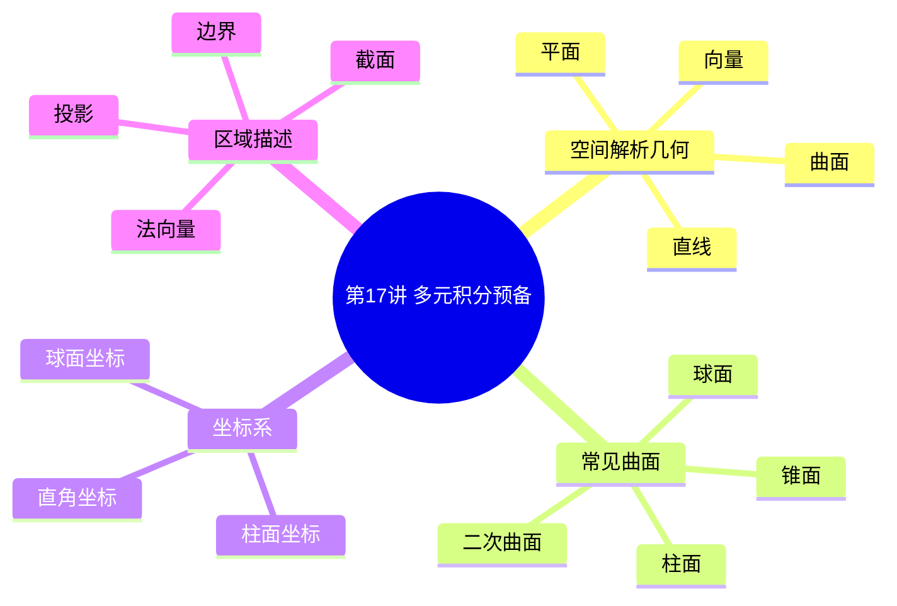
```mermaid
mindmap
  root((第17讲 多元积分预备))
    空间解析几何
      向量
      平面
      直线
      曲面
    常见曲面
      柱面
      锥面
      球面
      二次曲面
    坐标系
      直角坐标
      柱面坐标
      球面坐标
    区域描述
      投影
      截面
      边界
      法向量
```

### 知识点清单

- 向量运算：点乘用于夹角和投影，叉乘用于法向量、面积和方向。$|\mathbf{a}\times\mathbf{b}|$ 表示平行四边形面积。
- 平面方程：点法式 $\mathbf{n}\cdot[(x,y,z)-(x_0,y_0,z_0)]=0$；一般式 $Ax+By+Cz+D=0$。
- 直线方程：点向式 $\frac{x-x_0}{l}=\frac{y-y_0}{m}=\frac{z-z_0}{n}$；也可由两平面交线表示。
- 常见曲面：球面、柱面、锥面、旋转抛物面、椭球面、双曲面。识别时看缺少变量、平方项符号和截面。
- 柱面：方程缺少某个变量，表示沿该变量方向平移生成的曲面。
- 空间区域描述：先看投影到 $xy$ 平面，再写 $z$ 的上下界；或选择适合的坐标系简化边界。
- 柱面坐标：$x=r\cos\theta,y=r\sin\theta,z=z$，适合绕 $z$ 轴对称区域。
- 球面坐标：$x=\rho\sin\varphi\cos\theta,y=\rho\sin\varphi\sin\theta,z=\rho\cos\varphi$，适合球、锥、原点距离结构。
- 曲线切向量：参数方程 $\mathbf{r}(t)$ 的导数 $\mathbf{r}'(t)$ 给出切向量。
- 曲面法向量：隐式曲面 $F=0$ 的法向量为 $\nabla F$；参数曲面用 $\mathbf{r}_u\times\mathbf{r}_v$。
- 投影与边界：多元积分中最常见错误是区域写错，必须先确定外层变量范围和内层上下界。

---

## 第18讲 多元函数积分学（仅数学一）

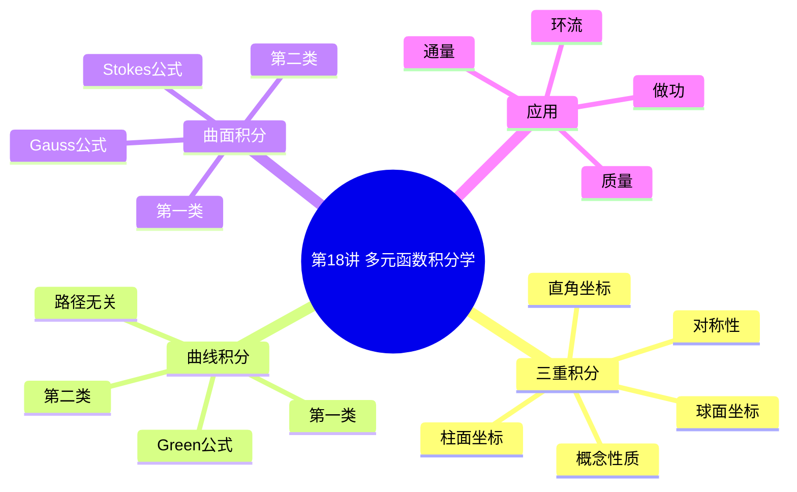
```mermaid
mindmap
  root((第18讲 多元函数积分学))
    三重积分
      概念性质
      直角坐标
      柱面坐标
      球面坐标
      对称性
    曲线积分
      第一类
      第二类
      Green公式
      路径无关
    曲面积分
      第一类
      第二类
      Gauss公式
      Stokes公式
    应用
      质量
      做功
      通量
      环流
```

### 知识点清单

- 三重积分：对空间区域 $\Omega$ 分割、近似、求和、取极限，记为 $\iiint_\Omega f(x,y,z)dv$。
- 直角坐标计算：通常写成投影区域上的二重积分再对 $z$ 积分，或按 $x,y,z$ 某一顺序迭代。
- 柱面坐标：$dv=rdrd\theta dz$，适合圆柱、圆锥、旋转体以及含 $x^2+y^2$ 的函数。
- 球面坐标：$dv=\rho^2\sin\varphi\,d\rho d\varphi d\theta$，适合球域、锥面边界、含 $x^2+y^2+z^2$ 的函数。
- 三重积分对称性：空间区域关于坐标面、坐标轴或原点对称时，奇函数部分积分为 0，偶对称可倍乘。
- 第一类曲线积分：$\int_L f(x,y,z)ds$，与方向无关，用参数方程化为 $\int f(\mathbf{r}(t))|\mathbf{r}'(t)|dt$。
- 第二类曲线积分：$\int_L Pdx+Qdy+Rdz$，与方向有关，用参数方程代入 $dx=x'(t)dt$ 等。
- Green 公式：平面闭曲线正向围成区域 $D$ 时，$\oint_L Pdx+Qdy=\iint_D(Q_x-P_y)dA$。注意正向通常为逆时针。
- 路径无关：若 $Pdx+Qdy$ 在单连通区域内满足 $P_y=Q_x$，则积分与路径无关，存在势函数。
- 第一类曲面积分：$\iint_\Sigma f\,dS$，与侧向无关。显式曲面 $z=z(x,y)$ 时 $dS=\sqrt{1+z_x^2+z_y^2}dxdy$。
- 第二类曲面积分：$\iint_\Sigma P\,dydz+Q\,dzdx+R\,dxdy$，与曲面侧向有关，本质是通量积分 $\iint_\Sigma \mathbf{F}\cdot\mathbf{n}\,dS$。
- Gauss 公式：闭曲面外侧通量等于体积分 $\iiint_\Omega(P_x+Q_y+R_z)dv$。非闭曲面常补面再相减。
- Stokes 公式：空间曲线的环流可化为旋度穿过曲面的通量，方向由右手法则确定。
- 应用：质量、质心、转动惯量、变力做功、流量/通量、环流。建模时先判断积分类型和方向/侧向。
- 多元积分计算总原则：先画区域，选坐标系，写 Jacobian 或微元，利用对称性，最后检查方向和边界。

---

## 附录速查

- 图像变换：$y=f(x-a)$ 右移 $a$，$y=f(x)+b$ 上移 $b$，$y=f(-x)$ 关于 $y$ 轴对称，$y=-f(x)$ 关于 $x$ 轴对称，$y=f^{-1}(x)$ 关于 $y=x$ 对称。
- 绝对值图像：$y=|f(x)|$ 把 $x$ 轴下方部分翻到上方；$y=f(|x|)$ 保留右半边并关于 $y$ 轴对称到左边。
- 常用平面图形：圆、椭圆、抛物线、双曲线、心形线、玫瑰线、摆线等，重点记面积和极坐标表达。
- 常用空间图形：球、圆柱、圆锥、椭球、抛物面、双曲面，重点记截面、投影和适合的坐标系。
- 重要公式：基本导数表、基本积分表、常用等价无穷小、Taylor 展开、常见级数展开。
- 双曲函数：$\sinh x=(e^x-e^{-x})/2$，$\cosh x=(e^x+e^{-x})/2$，$\cosh^2x-\sinh^2x=1$。
- 变形技巧：通分、有理化、配凑微分、拆项、加减同一项、取对数、换元、对称配对。
